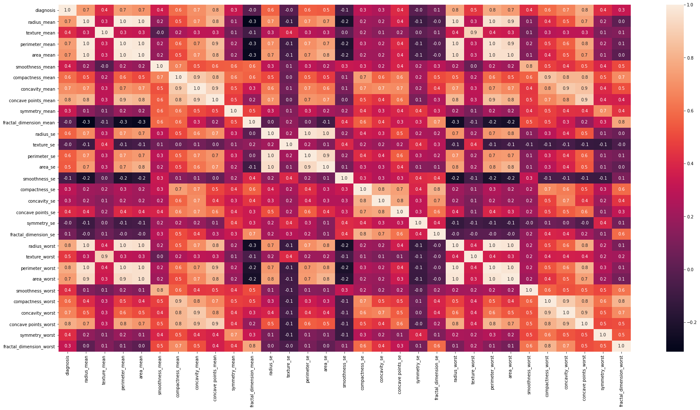
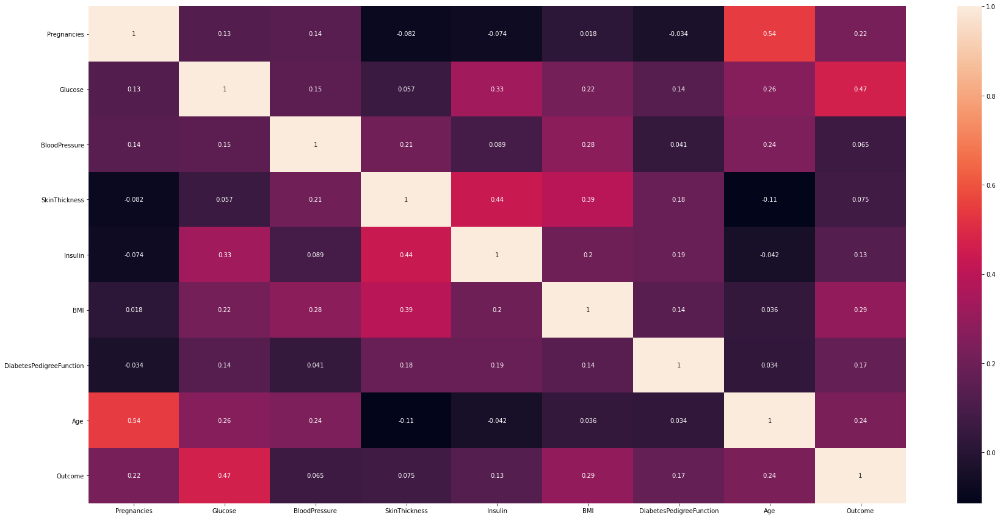
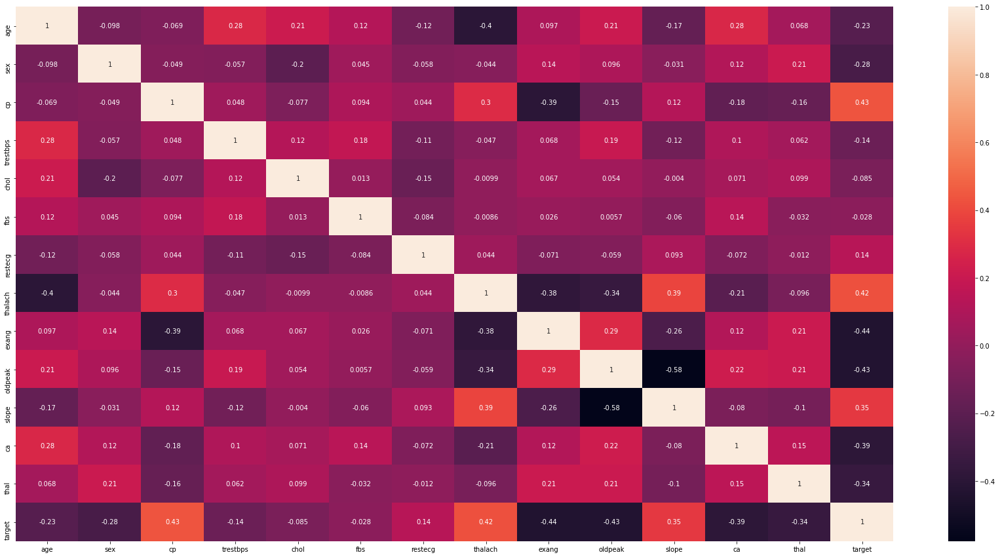
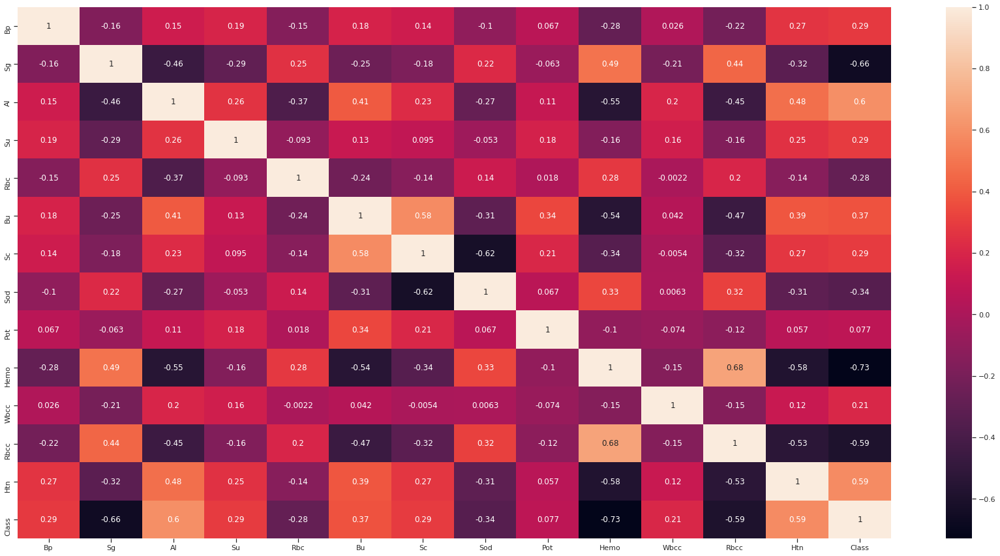
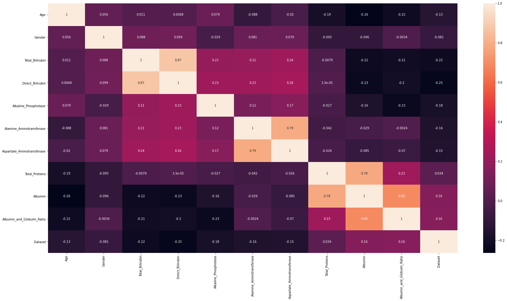

# Machine Learning (ML) in Dava(Medicine)

  
  
  
## 📌 Introduction:-

The repository contains various python jupyter notebooks of predicting different medical diseases from various open source datasets.The following medical diseases predicted are cancer,,diabeties,kidney diseases,heart disease,liver diseases,spine using variou machine learning classification algorithms like KNN,Logistic Regression,Support Vector Machine,Decision Tree,Random Forest

## ✔✔ Accuracy ✔✔:-
| Disease Name          | Logistic Regression | K Nearest Neighbors | Support Vector Machine  | Decision Tree | Random Forest   | 
|-----------------------|---------------------|---------------------|-------------------------|---------------|-----------------|
| Cancer                | 99.12%              | 96.49%              | 94.73%                  | 92.10%        | 97.36%          |
| Diabeties             | 76.62%              | 72.07%              | 78.57%                  | 75.97%        | 74.02%          |
| Kidney                | 97.50%              | 72.50%              | 96.25%                  | 98.75%        | 100.0%          |
| Heart                 | 85.24%              | 73.77%              | 86.88%                  | 85.24%        | 86.88%          |
| Liver                 | 78.16%              | 66.09%              | 74.71%                  | 74.71%        | 74.71%          |
| Spine                 | 83.87%              | 87.09%              | %                  | 74.71%        | 74.71%          |

## 🏁 Datasets Used:-
1. [Cancer Dataset](https://www.kaggle.com/uciml/breast-cancer-wisconsin-data) 

Heat Map of The dataset is

2. [Pima Indians Diabeties Dataset](https://www.kaggle.com/uciml/pima-indians-diabetes-database) 

Heat Map of The dataset is

3. [Heart Disease UCI](https://www.kaggle.com/ronitf/heart-disease-uci) 

Heat Map of The dataset is

4. [Chronic Kidney Disease Dataset](https://www.kaggle.com/abhia1999/chronic-kidney-disease) 

Heat Map of The dataset is

5. [Indian Liver Patient Records](https://www.kaggle.com/uciml/indian-liver-patient-records) 

Heat Map of The dataset is

5. [Lower back Spine Pain](https://www.kaggle.com/sammy123/lower-back-pain-symptoms-dataset/download) 

Heat Map of The dataset is

## 📧Contact:-
For any kind of suggesstions/ help in models code Please mail me at ksdkamesh99@gmail.com.

## 📜 LICENSE
[MIT](https://github.com/ksdkamesh99/ML-in-Dava/blob/master/LICENSE)

